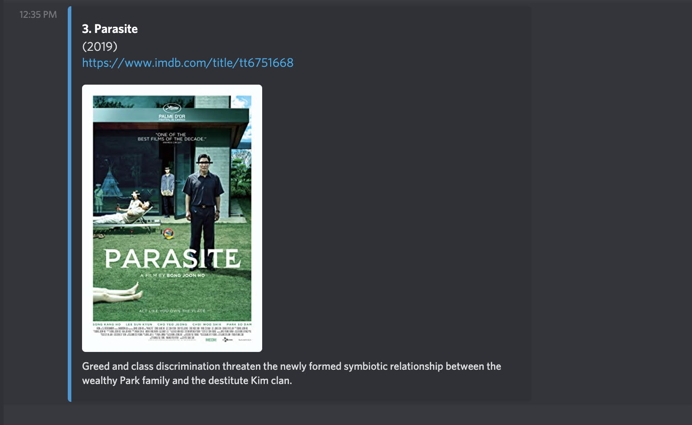

# moviemotion

Link to the Discord bot:
https://discord.com/api/oauth2/authorize?client_id=817629274672332830&permissions=83968&scope=bot

### Inspiration
We could never find a movie to watch, we would end up scrolling through Netflix for 20 minutes and not click on anything. So we thought, what if we could get movie recommendations based on what we felt like watching?

### What it does
moviemotion is a Discord bot that takes your recent Discord messages in a server, analyzes them with Natural Language Processing for sentiment/emotion, then DM's you movie recommendations based on your mood. Awesome, right?

### How we built it
We used Python and the Discord.py library to build the bot itself. Then we had the bot scrape the calling user's recent message history, after which we used an NLP library to run emotion analysis and determine the user's mood based on those messages. We then matched their mood to movie genres and found the top movies in those genres on IMDb. Then using OMDB's API, we gathered data on each randomly selected movie in the right genres, and formatted the result to be sent as a DM with 3 movie recommendations to the user.

### Challenges we ran into
Learning Python, learning how to create a Discord bot, trying 20 different things to get user message history, searching the web for movie API's we could use for free, and working with our different schedules.

### How to use it
Once the bot's been invited to your favorite Discord server, just call on moviemotion with "!moviemotion" and you'll get a DM with 3 personalized movie recommendations. Simple as that!

### Screenshots

### Youtube demo 
https://youtu.be/RojB7Gip0NM 

